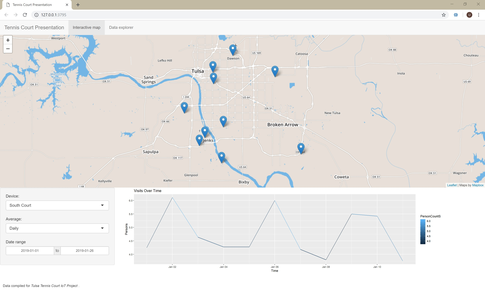

# TennisCourtIoT-Visualization

- [Introduction](#introduction)
- [Live Demo](#purpose-demo)
- [Screenshots](#screenshots)

# Introduction
Data Visualization for the TennisCourtIoT project, utilizing R programming, MongoDB and ShinyApps.

#Live Demo
https://samahu.shinyapps.io/TennisCourtIoT-Visualization/

# Screenshots
Screenshots of the current dashboard:

__Note__: Due to lack of support to recent version mongolite from Azure CosmosDB API, you need to fallback mongolite version 1.6 to get things working:
install.packages('mongolite', repos = 'https://cran.microsoft.com/snapshot/2018-08-01')
