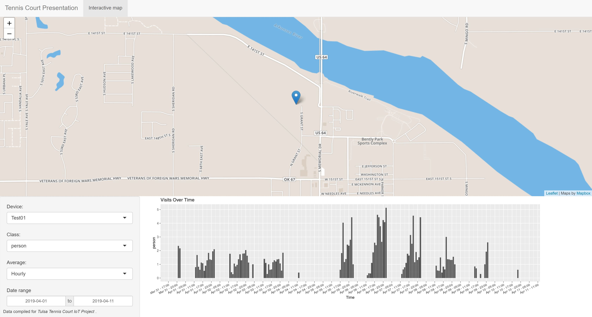

# TennisCourtIoT-Visualization
Data Visualization for the TennisCourtIoT project, utilizing R programming, MongoDB and ShinyApps.

Screenshots of the current dashboard:

#note: had to fallback to mongolite version 1.6 due to Azure being not up to date:
install.packages('mongolite', repos = 'https://cran.microsoft.com/snapshot/2018-08-01')
